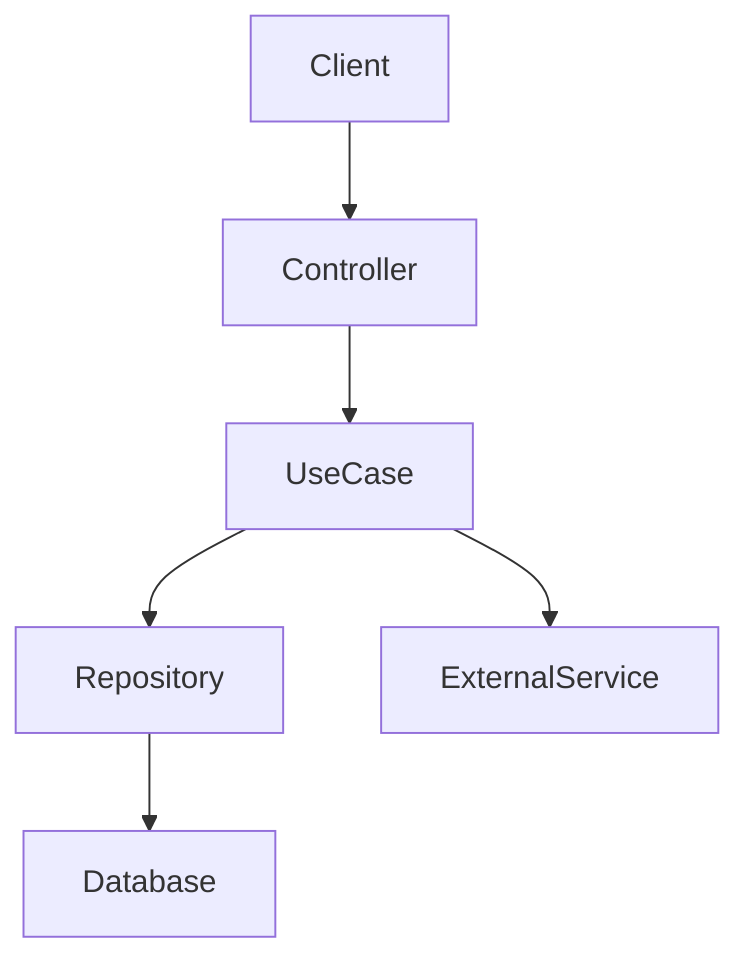
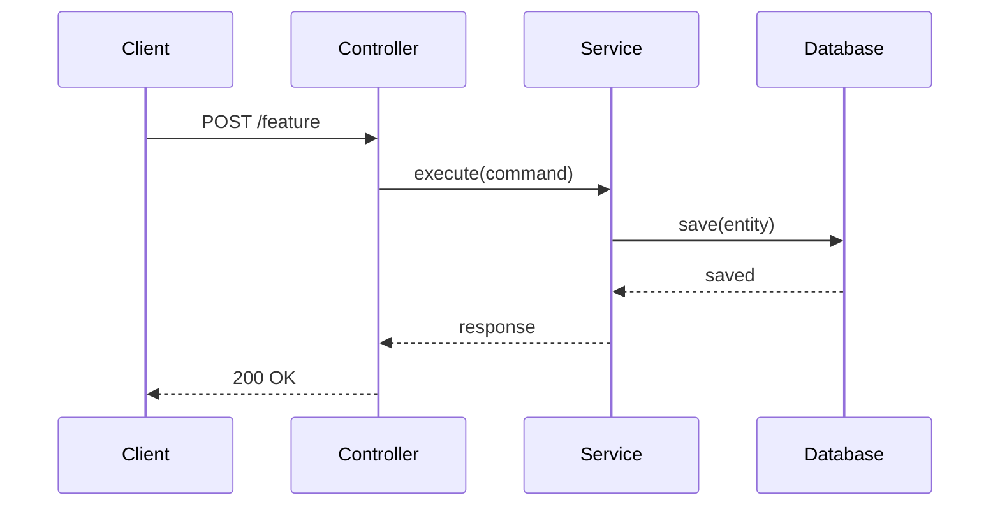

# Step 01 — Architecture Design

## Khi nào cần vẽ kiến trúc

Bắt buộc vẽ nếu chức năng có **bất kỳ** điều kiện sau:
- Liên quan đến **nhiều hơn 2 layers** (controller → service → repo → external)
- Có **async flow**, event-driven, hoặc message queue
- Có **integration** với external service (API, DB, cache, 3rd party)
- Có **state management** phức tạp (mobile)
- Là **microservice** mới hoặc thay đổi contract giữa services

Không cần vẽ nếu: fix bug nhỏ, thêm field đơn giản, refactor nội bộ 1 class.

## Output bắt buộc

### A. Component Diagram (Mermaid)
Mô tả các thành phần tham gia và quan hệ giữa chúng.



### B. Sequence Diagram (Mermaid)
Mô tả luồng xử lý theo thời gian — bắt buộc nếu có async hoặc multi-step flow.



### C. API Contract (nếu có endpoint mới)
```
Method: POST /api/v1/feature
Request:  { field1: string, field2: number }
Response: { id: string, status: string }
Errors:   400 Bad Request, 404 Not Found, 500 Internal Server Error
```

### D. Data Model (nếu có schema mới)
Mô tả các entity/table/model mới hoặc thay đổi.

## Checklist trước khi qua Step 02
- [ ] Component diagram đã vẽ (nếu cần)
- [ ] Sequence diagram đã vẽ (nếu có async/multi-step)
- [ ] API contract đã định nghĩa (nếu có endpoint mới)
- [ ] Data model đã mô tả (nếu có schema mới)
- [ ] Architecture đã được review và không có circular dependency
