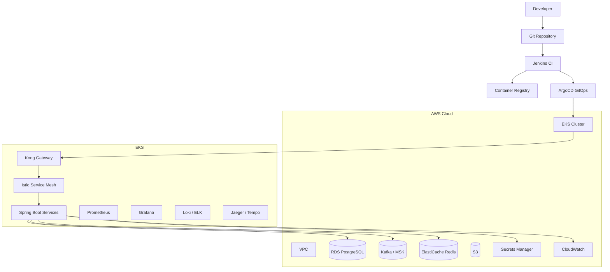

# DevOps Engineering Playbook — AWS EKS + Istio + RDS + Kafka + Redis + Kong

> Mục tiêu: tạo một bộ guideline DevOps/SRE đủ xịn để dùng cho Claude, Codex, hoặc team engineering khi triển khai hệ thống production-grade trên AWS.

---

# 1. DevOps Engineering Mindset

DevOps không chỉ là viết Terraform hay deploy service.

DevOps Engineering chịu trách nhiệm thiết kế, tự động hóa, vận hành và bảo vệ toàn bộ vòng đời hệ thống:

* Infrastructure as Code
* CI/CD pipeline
* Kubernetes platform
* Service Mesh
* Observability
* Security
* Reliability
* Cost Optimization
* Release Management
* Incident Response

Rule quan trọng:

> Mọi thứ lặp lại nhiều hơn 2 lần phải được tự động hóa.

---

# 2. Target Architecture



---

# 3. Recommended Repository Structure

```text
.devops/
├── README.md
├── architecture/
│   ├── aws-platform.md
│   ├── eks-platform.md
│   ├── network-design.md
│   ├── service-mesh.md
│   └── observability.md
│
├── terraform/
│   ├── README.md
│   ├── environments/
│   │   ├── dev/
│   │   ├── staging/
│   │   └── prod/
│   └── modules/
│       ├── vpc/
│       ├── eks/
│       ├── rds-postgres/
│       ├── redis/
│       ├── msk-kafka/
│       ├── iam/
│       ├── secrets-manager/
│       └── monitoring/
│
├── helm/
│   ├── README.md
│   ├── charts/
│   │   ├── springboot-service/
│   │   ├── kong/
│   │   ├── istio-addons/
│   │   └── observability-stack/
│   └── values/
│       ├── dev/
│       ├── staging/
│       └── prod/
│
├── kubernetes/
│   ├── namespaces/
│   ├── network-policies/
│   ├── configmaps/
│   ├── secrets/
│   ├── hpa/
│   ├── pdb/
│   └── service-accounts/
│
├── gitops/
│   ├── argocd-apps/
│   ├── projects/
│   └── app-of-apps/
│
├── ci-cd/
│   ├── jenkins/
│   │   ├── Jenkinsfile.springboot
│   │   ├── Jenkinsfile.terraform
│   │   └── shared-library.md
│   └── release-process.md
│
├── sre/
│   ├── sli-slo.md
│   ├── incident-response.md
│   ├── runbook-template.md
│   ├── rollback.md
│   ├── capacity-planning.md
│   └── disaster-recovery.md
│
├── security/
│   ├── iam.md
│   ├── secrets.md
│   ├── network-security.md
│   ├── container-security.md
│   ├── kubernetes-security.md
│   └── compliance-checklist.md
│
├── observability/
│   ├── logging.md
│   ├── metrics.md
│   ├── tracing.md
│   ├── alerting.md
│   └── dashboard-standard.md
│
└── generators/
    ├── create-service-deployment.md
    ├── create-terraform-module.md
    ├── create-helm-chart.md
    ├── create-jenkins-pipeline.md
    ├── create-argocd-app.md
    └── production-readiness-review.md
```

---

# 4. Phase Roadmap

## Phase 1 — Foundation Infrastructure

Triển khai hạ tầng nền trước, chưa deploy business service.

Bao gồm:

* AWS IAM baseline
* VPC
* Public/private subnets
* NAT Gateway
* Security Groups
* EKS Cluster
* EKS Node Groups
* AWS Load Balancer Controller
* EBS CSI Driver
* External Secrets Operator
* Cert Manager

Output mong đợi:

* Có EKS cluster chạy ổn định
* Có thể kubectl vào cluster
* Có namespace chuẩn
* Có ingress/load balancer hoạt động

---

## Phase 2 — Platform Services

Triển khai các platform components.

Bao gồm:

* Istio
* Kong Gateway
* ArgoCD
* Prometheus
* Grafana
* Loki hoặc ELK
* Jaeger hoặc Tempo
* External DNS
* Cluster Autoscaler hoặc Karpenter

Output mong đợi:

* Gateway route được traffic vào service
* Service-to-service traffic đi qua Istio sidecar
* Có metrics/logs/traces
* Có GitOps deployment flow

---

## Phase 3 — Data Layer

Triển khai managed data services.

Bao gồm:

* RDS PostgreSQL
* ElastiCache Redis
* Kafka/MSK hoặc Strimzi Kafka
* S3 bucket
* Secrets Manager

Output mong đợi:

* App có thể kết nối DB/Redis/Kafka qua secret/config chuẩn
* Có backup strategy
* Có monitoring cho database/cache/message broker

---

## Phase 4 — CI/CD + GitOps

Chuẩn hóa build, test, scan, release.

Pipeline chuẩn:

```text
Commit
 -> Unit Test
 -> Static Code Analysis
 -> Build Artifact
 -> Build Docker Image
 -> Security Scan
 -> Push Image
 -> Update Helm Values
 -> ArgoCD Sync
 -> Smoke Test
 -> Promote Environment
```

Output mong đợi:

* Mỗi service có pipeline riêng
* Không deploy thủ công bằng tay
* Rollback được bằng GitOps
* Có approval gate cho staging/prod

---

## Phase 5 — Production Readiness

Chuẩn hóa vận hành production.

Bao gồm:

* SLI/SLO
* Alert rules
* Runbook
* Incident process
* DR plan
* Backup/restore test
* Load test
* Chaos test
* Cost monitoring

Output mong đợi:

* Biết service chết ở đâu
* Biết rollback như thế nào
* Biết capacity cần bao nhiêu
* Biết khi nào vi phạm SLO

---

# 5. Terraform Standard

Terraform dùng để tạo infrastructure thật trên AWS.

Terraform quản lý:

* VPC
* Subnet
* Route table
* IAM
* EKS
* RDS
* Redis
* Kafka
* S3
* Security Group
* Secrets Manager

Không nên dùng Terraform để quản lý từng Deployment application nhỏ trong Kubernetes. Phần app nên dùng Helm + ArgoCD.

## Terraform Module Rule

Mỗi module phải có:

```text
modules/<module-name>/
├── main.tf
├── variables.tf
├── outputs.tf
├── versions.tf
└── README.md
```

## Environment Rule

```text
environments/dev/main.tf
environments/staging/main.tf
environments/prod/main.tf
```

Mỗi environment có:

* backend state riêng
* variable riêng
* resource size riêng
* tagging riêng

## Terraform Naming Convention

Pattern:

```text
<project>-<env>-<resource>
```

Ví dụ:

```text
vpay-dev-eks
vpay-dev-rds-postgres
vpay-dev-redis
vpay-dev-msk
```

## Terraform Tag Standard

Mọi resource AWS phải có tag:

```hcl
tags = {
  Project     = "vpay"
  Environment = "dev"
  Owner       = "platform-team"
  ManagedBy   = "terraform"
  CostCenter  = "wallet-platform"
}
```

---

# 6. Helm Chart Standard

Helm dùng để package Kubernetes manifest.

Helm quản lý:

* Deployment
* Service
* Ingress/Gateway
* ConfigMap
* Secret reference
* HPA
* PDB
* ServiceAccount
* Istio VirtualService
* Istio DestinationRule

## Standard Chart Structure

```text
springboot-service/
├── Chart.yaml
├── values.yaml
├── values-dev.yaml
├── values-staging.yaml
├── values-prod.yaml
└── templates/
    ├── deployment.yaml
    ├── service.yaml
    ├── hpa.yaml
    ├── pdb.yaml
    ├── serviceaccount.yaml
    ├── configmap.yaml
    ├── virtualservice.yaml
    └── destinationrule.yaml
```

## Helm Values Rule

Không hard-code image tag, resource limit, domain, secret trong template.

Sai:

```yaml
image: vpay/payment-service:latest
```

Đúng:

```yaml
image:
  repository: vpay/payment-service
  tag: "1.0.0"
```

---

# 7. Kubernetes Standard

## Namespace Standard

```text
platform-system
istio-system
kong-system
argocd
observability
dev
staging
prod
```

## Application Deployment Rule

Mỗi service production phải có:

* Deployment
* Service
* ConfigMap
* Secret reference
* Readiness probe
* Liveness probe
* Resource requests/limits
* HPA
* PDB
* ServiceAccount
* NetworkPolicy
* Istio sidecar injection

## Resource Standard

Ví dụ baseline cho Spring Boot service:

```yaml
resources:
  requests:
    cpu: 250m
    memory: 512Mi
  limits:
    cpu: 1000m
    memory: 1Gi
```

## Probe Standard

```yaml
readinessProbe:
  httpGet:
    path: /actuator/health/readiness
    port: 8080
  initialDelaySeconds: 30
  periodSeconds: 10

livenessProbe:
  httpGet:
    path: /actuator/health/liveness
    port: 8080
  initialDelaySeconds: 60
  periodSeconds: 20
```

Rule:

> Không có readiness/liveness probe thì không được lên staging/prod.

---

# 8. Istio Service Mesh Standard

Istio dùng để quản lý internal traffic.

Dùng cho:

* mTLS
* traffic routing
* retry
* timeout
* circuit breaking
* observability
* canary release
* service-to-service policy

## Rule

Service nội bộ không gọi nhau qua public gateway.

Flow chuẩn:

```text
Service A -> Istio Sidecar -> Service B
```

## DestinationRule Example

```yaml
apiVersion: networking.istio.io/v1beta1
kind: DestinationRule
metadata:
  name: payment-service
spec:
  host: payment-service.default.svc.cluster.local
  trafficPolicy:
    tls:
      mode: ISTIO_MUTUAL
    connectionPool:
      http:
        http1MaxPendingRequests: 100
        maxRequestsPerConnection: 100
    outlierDetection:
      consecutive5xxErrors: 5
      interval: 30s
      baseEjectionTime: 30s
```

## VirtualService Example

```yaml
apiVersion: networking.istio.io/v1beta1
kind: VirtualService
metadata:
  name: payment-service
spec:
  hosts:
    - payment-service.default.svc.cluster.local
  http:
    - timeout: 3s
      retries:
        attempts: 3
        perTryTimeout: 1s
        retryOn: 5xx,connect-failure,refused-stream
      route:
        - destination:
            host: payment-service.default.svc.cluster.local
            port:
              number: 8080
```

---

# 9. Kong Gateway Standard

Kong dùng cho external API traffic.

Dùng cho:

* Authentication
* Authorization
* Rate limit
* Request validation
* Consumer management
* API routing
* Public ingress

Flow chuẩn:

```text
Client -> Kong Gateway -> Istio Ingress Gateway -> Internal Service
```

Hoặc nếu dùng Kong Ingress Controller trực tiếp:

```text
Client -> Kong -> Kubernetes Service -> Istio Sidecar -> App
```

## Kong Plugin Baseline

Production API nên có:

* JWT/OIDC plugin
* Rate limiting plugin
* Request size limiting
* CORS
* IP restriction nếu cần
* Correlation ID
* Prometheus plugin

---

# 10. Database Standard — RDS PostgreSQL

RDS PostgreSQL dùng cho transactional database.

## Rule

* App không dùng root user
* Mỗi service có database/schema/user riêng
* Password lưu trong Secrets Manager
* Migration dùng Flyway hoặc Liquibase
* Backup bật mặc định
* Multi-AZ cho production
* Performance Insights bật cho staging/prod

## Connection Rule

Spring Boot kết nối qua secret/config:

```text
DB_HOST
DB_PORT
DB_NAME
DB_USERNAME
DB_PASSWORD
```

Không hard-code trong application.yml.

---

# 11. Redis Standard

Redis dùng cho:

* idempotency key
* distributed lock
* cache
* rate-limit counter
* short-lived session/state

## Rule

* Key phải có prefix
* Key phải có TTL
* Không lưu data vĩnh viễn trong Redis
* Không cache dữ liệu nhạy cảm nếu chưa mã hóa

## Key Naming

```text
<service>:<domain>:<purpose>:<id>
```

Ví dụ:

```text
payment:idempotency:transfer:requestId123
notification:lock:sync:userId123
```

---

# 12. Kafka Standard

Kafka dùng cho event-driven communication.

## Topic Naming

```text
<domain>.<service>.<event-name>
```

Ví dụ:

```text
payment.transaction.created
wallet.balance.updated
notification.communication.push-high-priority
```

## Consumer Group Naming

```text
<service-name>.<purpose>
```

Ví dụ:

```text
payment-service.transaction-created-consumer
notification-service.push-consumer
```

## Rule

* Message phải có eventId
* Message phải có occurredAt
* Message phải có traceId/correlationId
* Consumer phải idempotent
* Retry phải có chiến lược rõ
* Dead-letter topic bắt buộc cho flow quan trọng

---

# 13. CI/CD Standard

## Jenkins Pipeline Baseline

```text
1. Checkout
2. Validate branch
3. Run unit test
4. Run integration test nếu có
5. Static code analysis
6. Build artifact
7. Build Docker image
8. Scan Docker image
9. Push image
10. Update Helm values
11. Create GitOps PR hoặc auto-commit dev
12. ArgoCD sync
13. Smoke test
14. Notify result
```

## Branch Strategy

```text
main        -> production
release/*   -> staging
develop     -> dev
feature/*   -> development work
hotfix/*    -> urgent production fix
```

## Deployment Rule

* Dev: auto deploy
* Staging: deploy with approval
* Prod: deploy with approval + change record

---

# 14. ArgoCD GitOps Standard

ArgoCD là nguồn deploy chính.

Rule:

> Không kubectl apply thủ công lên production.

## App-of-Apps Pattern

```text
gitops/
├── root-app.yaml
├── platform/
│   ├── istio.yaml
│   ├── kong.yaml
│   ├── monitoring.yaml
│   └── external-secrets.yaml
└── services/
    ├── payment-service.yaml
    ├── wallet-service.yaml
    └── notification-service.yaml
```

## Sync Policy

Dev có thể auto-sync.

Staging/prod nên dùng manual sync hoặc gated sync.

---

# 15. Observability Standard

## Logging

Log phải có:

* timestamp
* level
* serviceName
* traceId
* spanId
* requestId
* userId nếu được phép
* errorCode
* latency

Không log:

* password
* token
* OTP
* card number
* secret key
* private key

## Metrics

Service phải expose:

```text
/actuator/prometheus
```

Metric quan trọng:

* request rate
* error rate
* latency p95/p99
* JVM memory
* thread pool
* DB connection pool
* Kafka consumer lag
* Redis latency

## Tracing

Dùng OpenTelemetry.

Trace phải đi xuyên suốt:

```text
Mobile/BFF -> Kong -> Service A -> Kafka/DB -> Service B
```

---

# 16. SRE Standard

## Golden Signals

Theo dõi 4 tín hiệu chính:

* Latency
* Traffic
* Errors
* Saturation

## SLO Example

```text
Payment API availability >= 99.9%
P95 latency <= 500ms
Error rate <= 0.1%
Kafka consumer lag <= 1000 messages
```

## Incident Severity

```text
SEV1: Production down / money movement impacted
SEV2: Major feature degraded
SEV3: Partial issue, workaround available
SEV4: Minor issue
```

## Runbook Required

Mỗi service production cần có:

* How to check health
* How to check logs
* How to check metrics
* How to rollback
* Common errors
* Escalation owner

---

# 17. Security Standard

## IAM Rule

* Least privilege
* No long-lived access key nếu không cần
* Use IAM Roles for Service Accounts trên EKS
* Separate role per service

## Secret Rule

* Không commit secret vào Git
* Secret lưu ở AWS Secrets Manager hoặc SSM Parameter Store
* Kubernetes Secret nên được sync bằng External Secrets Operator
* Rotation strategy phải có cho production

## Container Security

* Không chạy container bằng root user
* Image phải scan CVE
* Không dùng latest tag
* Base image phải được approve
* Read-only filesystem nếu có thể

## Kubernetes Security

* RBAC tối thiểu
* NetworkPolicy cho namespace quan trọng
* PodSecurity standard
* LimitRange và ResourceQuota
* Không expose service bằng NodePort tùy tiện

---

# 18. Production Readiness Checklist

Một service chỉ được lên production nếu có đủ:

* [ ] Dockerfile chuẩn
* [ ] Helm chart chuẩn
* [ ] Resource requests/limits
* [ ] Readiness probe
* [ ] Liveness probe
* [ ] HPA
* [ ] PDB
* [ ] Config externalized
* [ ] Secret không hard-code
* [ ] Logs có traceId
* [ ] Metrics có Prometheus endpoint
* [ ] Tracing có OpenTelemetry
* [ ] Dashboard Grafana
* [ ] Alert rules
* [ ] Runbook
* [ ] Rollback guide
* [ ] Security scan passed
* [ ] Load test baseline
* [ ] DR/backup impact reviewed

---

# 19. Generator Prompt — Create Terraform Module

```text
You are a Senior DevOps Engineer.

Create a production-grade Terraform module for: <RESOURCE_NAME>.

Context:
- Cloud: AWS
- IaC: Terraform
- Environment: dev/staging/prod
- Project naming pattern: <project>-<env>-<resource>
- Must support tagging standard
- Must expose clean variables and outputs
- Must not hard-code environment-specific values

Required output:
1. modules/<resource>/main.tf
2. modules/<resource>/variables.tf
3. modules/<resource>/outputs.tf
4. modules/<resource>/versions.tf
5. modules/<resource>/README.md
6. environments/dev example usage

Rules:
- Follow least privilege
- Add validation for important variables
- Add useful outputs
- Keep module reusable
- Explain security considerations
```

---

# 20. Generator Prompt — Create Helm Chart

```text
You are a Senior Platform Engineer.

Create a reusable Helm chart for Spring Boot microservice.

Service context:
- Runtime: Java 21 / Spring Boot
- Port: 8080
- Health endpoints:
  - /actuator/health/readiness
  - /actuator/health/liveness
  - /actuator/prometheus
- Platform: AWS EKS
- Service Mesh: Istio
- Gateway: Kong
- GitOps: ArgoCD

Required templates:
1. deployment.yaml
2. service.yaml
3. hpa.yaml
4. pdb.yaml
5. serviceaccount.yaml
6. configmap.yaml
7. virtualservice.yaml
8. destinationrule.yaml
9. servicemonitor.yaml if Prometheus Operator is enabled

Rules:
- No hard-coded image tag
- Support env-specific values
- Support resource requests/limits
- Support probes
- Support autoscaling
- Support pod annotations for Istio/OpenTelemetry
- Support External Secrets reference
```

---

# 21. Generator Prompt — Create Jenkins Pipeline

```text
You are a Senior DevOps Engineer.

Create a Jenkins pipeline for a Spring Boot service.

Tech stack:
- Java 21
- Gradle
- Docker
- AWS ECR
- Helm
- ArgoCD GitOps
- SonarQube
- Trivy image scan

Pipeline stages:
1. Checkout
2. Validate branch
3. Unit test
4. Build jar
5. SonarQube scan
6. Docker build
7. Trivy scan
8. Push image to ECR
9. Update Helm values in GitOps repo
10. Trigger ArgoCD sync for dev
11. Smoke test
12. Notify Slack/Teams

Rules:
- No secret in Jenkinsfile
- Use credentials binding
- Fail pipeline if test or security scan fails
- Use semantic image tag: <service>:<git-sha>
- Support dev/staging/prod promotion
```

---

# 22. Generator Prompt — Production Readiness Review

```text
You are a Principal SRE reviewing a service before production release.

Review this service against production readiness criteria:

Input:
- Dockerfile
- Helm chart
- application.yml
- Terraform dependencies
- CI/CD pipeline
- Observability setup
- Security config

Check:
1. Deployment safety
2. Resource sizing
3. Autoscaling
4. Health checks
5. Logging
6. Metrics
7. Tracing
8. Alerting
9. Secrets
10. IAM/RBAC
11. Network security
12. Rollback strategy
13. Database migration safety
14. Kafka retry/DLQ strategy
15. Cost risk

Output format:
- Critical issues
- High issues
- Medium issues
- Low issues
- Recommended fixes
- Production approval: PASS / PASS WITH RISK / FAIL
```

---

# 23. What To Start First

Nếu bắt đầu từ con số 0, thứ tự nên làm:

```text
Step 1: Terraform AWS baseline
Step 2: VPC
Step 3: EKS
Step 4: kubectl + aws-auth/IAM access
Step 5: AWS Load Balancer Controller
Step 6: EBS CSI Driver
Step 7: Istio
Step 8: Kong
Step 9: ArgoCD
Step 10: Observability stack
Step 11: RDS PostgreSQL
Step 12: Redis
Step 13: Kafka/MSK
Step 14: Helm chart app mẫu
Step 15: Jenkins pipeline app mẫu
Step 16: GitOps deploy app mẫu
```

Rule:

> Đừng deploy business service trước khi platform baseline chạy ổn.

---

# 24. Definition of Done — DevOps Platform

Platform được xem là tạm ổn khi:

* Developer push code là có pipeline build
* Image được scan trước khi deploy
* ArgoCD quản lý deployment
* Service có logs/metrics/traces
* Gateway route được traffic
* Internal service call đi qua mesh
* Secret không nằm trong Git
* DB/Redis/Kafka dùng managed service hoặc operator chuẩn
* Có rollback path
* Có dashboard và alert cơ bản
* Có runbook cho incident

---

# 25. Final Rule

DevOps xịn không phải là nhiều tool.

DevOps xịn là:

* Deploy nhanh
* Rollback nhanh
* Debug nhanh
* Bảo mật mặc định
* Hệ thống chịu lỗi tốt
* Team dev không bị phụ thuộc manual vào DevOps
* Production có vấn đề là biết nhìn ở đâu trước
