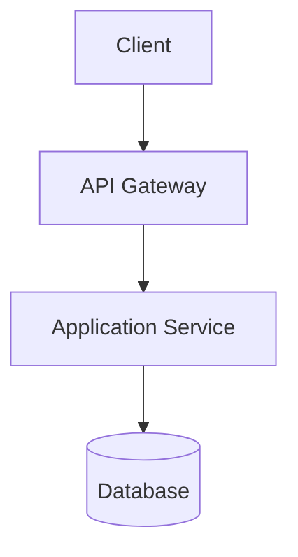
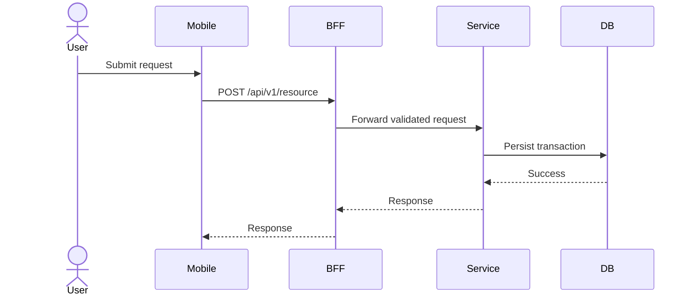
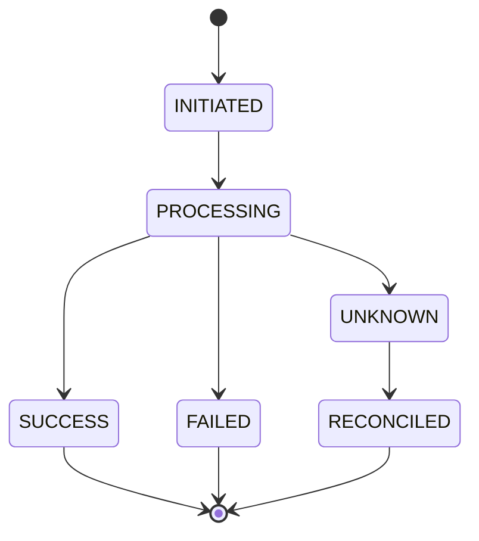
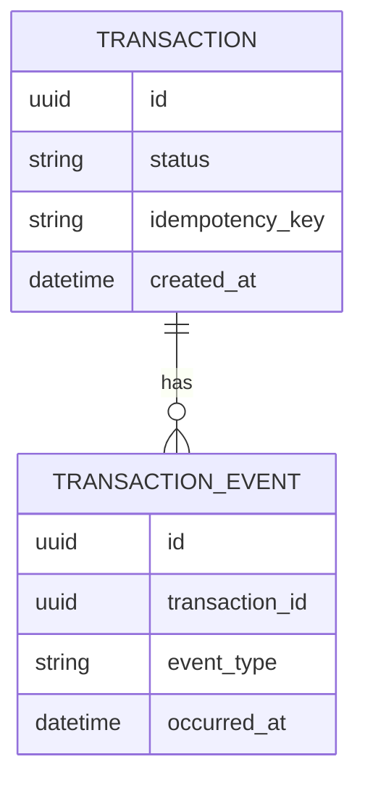
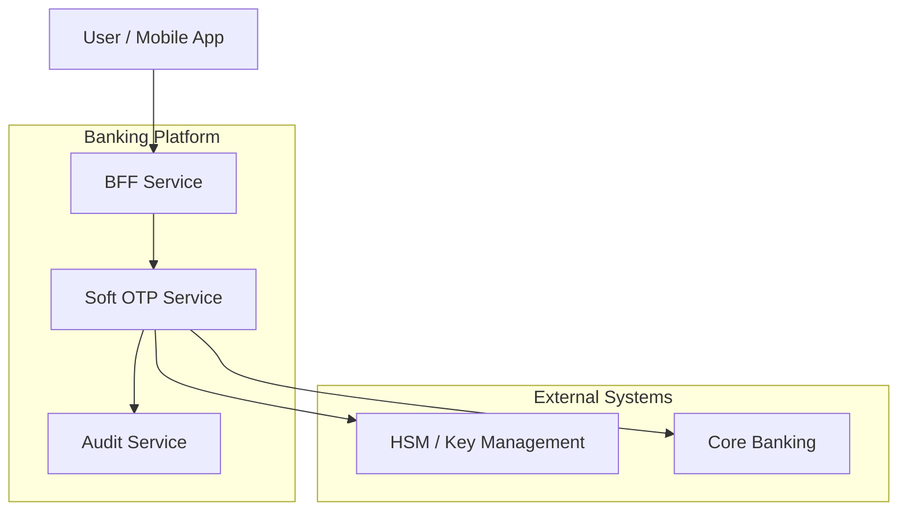

# documentation/diagram-standard.md — Diagram Writing Standard

## Objective

Define how Solution Architect agents must create technical diagrams for HLD, LLD, integration, API, data, deployment, and operational documents.

## When To Use

Use this skill when:

- Drawing architecture diagrams
- Drawing C4 diagrams
- Drawing sequence diagrams
- Drawing service flow
- Drawing integration flow
- Drawing state machine
- Drawing data model
- Drawing deployment topology
- Drawing event-driven architecture
- Drawing transaction flow

## Mandatory Rule

A diagram is not enough by itself.

Every diagram must have:

1. Purpose
2. Mermaid diagram
3. Explanation
4. Key decisions
5. Failure/security notes when relevant

## Diagram Selection Guide

| Need | Diagram Type |
|---|---|
| Show users and external systems | C4 Context / flowchart |
| Show deployable applications/services | C4 Container / flowchart |
| Show internal modules/components | Component diagram / flowchart |
| Show request flow | sequenceDiagram |
| Show async event flow | sequenceDiagram or flowchart |
| Show state lifecycle | stateDiagram-v2 |
| Show database relationship | erDiagram |
| Show infrastructure topology | flowchart |
| Show deployment flow | flowchart |
| Show decision branches | flowchart |
| Show timeline | sequenceDiagram |

## Mermaid Flowchart Standard

Use for HLD, component, deployment, and event flow.



Rules:

1. Use clear node names.
2. Use arrows to show direction.
3. Group components with `subgraph`.
4. Label external systems.
5. Label data stores with database shape.
6. Avoid too many details in one diagram.
7. Use multiple diagrams instead of one unreadable diagram.

## Sequence Diagram Standard

Use for LLD, API flow, partner integration, payment flow, OTP flow, and callback flow.



Rules:

1. Use actor for human/user.
2. Use participant for systems.
3. Show sync request and response.
4. Show error branches with `alt`.
5. Show optional flows with `opt`.
6. Show retry/failure if important.
7. Do not hide critical external dependency calls.

## State Diagram Standard

Use for transaction status, saga, OTP lifecycle, payment lifecycle.



Rules:

1. Define initial and terminal states.
2. Define uncertain/processing states when external systems are involved.
3. Define allowed transitions.
4. Define who/what triggers transition.
5. Define retry and reconciliation states.

## ER Diagram Standard

Use for data model and relationship.



Rules:

1. Show important entities only.
2. Include primary business fields.
3. Avoid dumping every column.
4. Explain ownership and lifecycle.
5. Mention indexes separately if needed.

## C4-Style Diagram Rule

If Mermaid C4 syntax is unavailable, use flowchart with C4-style grouping:



## Diagram Explanation Template

After every diagram, write:

```markdown
Explanation:

- `<component>` is responsible for ...
- `<arrow>` means ...
- This flow is synchronous/asynchronous because ...
- Failure handling:
  - ...
- Security notes:
  - ...
```

## Anti-patterns

Avoid:

- One giant diagram for everything
- No labels on arrows
- No separation between internal and external systems
- Mixing HLD and LLD detail in one diagram
- Diagram without text explanation
- Diagram that hides failure path
- Diagram that hides security boundary
- Diagram that does not match the written design

## Diagram Checklist

- [ ] Diagram has a clear purpose
- [ ] Diagram is readable
- [ ] Internal and external systems are separated
- [ ] Arrows have clear direction
- [ ] Important flows are labeled
- [ ] Failure path is shown if important
- [ ] Security boundary is shown if relevant
- [ ] Diagram has explanation
- [ ] Diagram matches the document text

## Prompt

```text
Use `.sa/documentation/diagram-standard.md`.

Create diagrams for: <TOPIC>.

Required diagrams:
- Context or container diagram
- Main sequence diagram
- State diagram if the flow has lifecycle/status
- ER diagram if data model is needed
- Deployment diagram if runtime topology is needed

Rules:
- Use Mermaid.
- Do not create one giant unreadable diagram.
- Every diagram must include explanation.
- Show internal and external systems clearly.
- Show failure/security notes where relevant.
```
